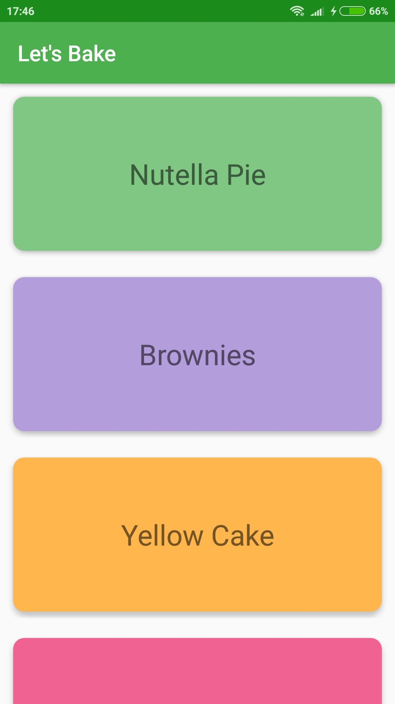
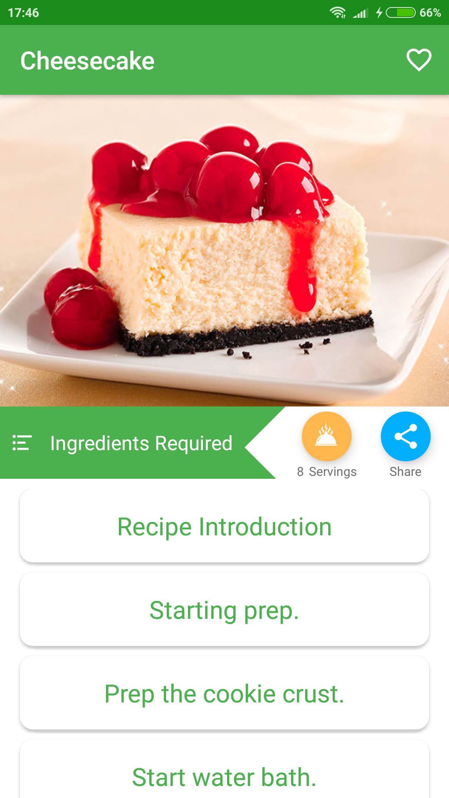
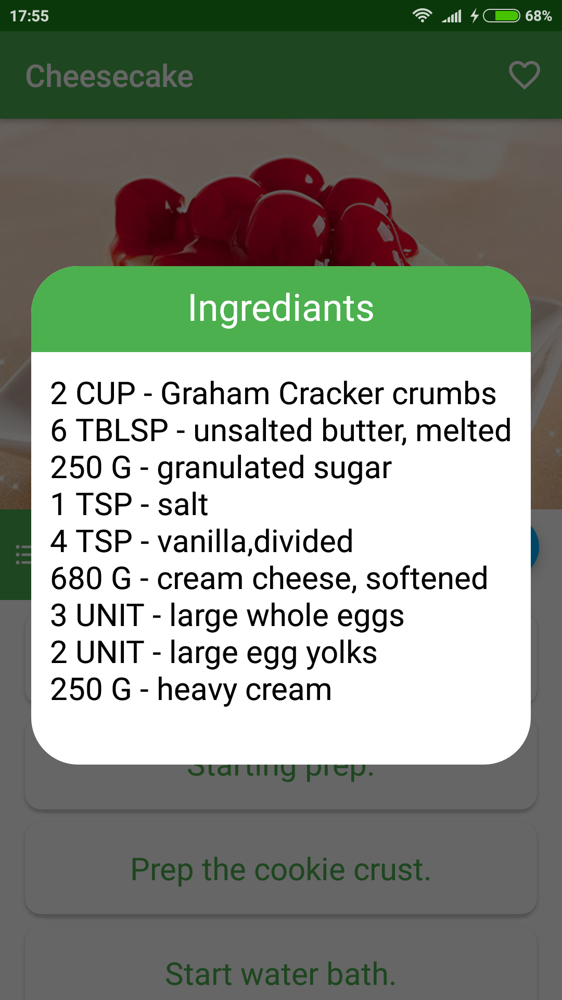
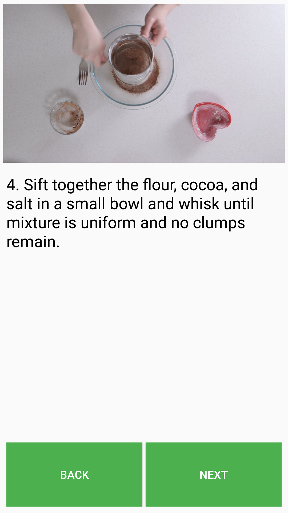
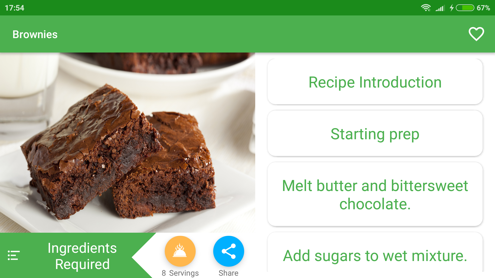
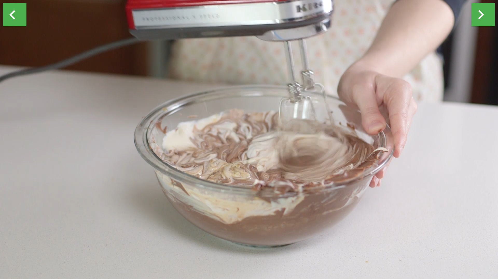

# Let's Bake Project

## Project Overview
You will productionize an app as part of the Advanced Android Developer Nanodegree, taking it from a functional state to a production-ready state.
This will involve finding and handling error cases, adding accessibility features, allowing for localization,
adding a widget, and adding a library.

## What Will I Learn?
Through this project, you will:
- Use MediaPlayer/Exoplayer to display videos.
- Handle error cases in Android.
- Add a widget to your app experience.
- Leverage a third-party library in your app.
- Use Fragments to create a responsive design that works on phones and tablets.
- Writing Espresso Tests

## App Description
- Displays recipes from provided network resource
- Navigate between individual recipes and recipe steps
- Steps include Videos, Images and a description
- Includes a homescreen Widget that shows the ingredients 
- Supports both phones and tablets
- Share the App with friends
- Use of Espresso to test aspects of the UI
-----------------------
 
  

